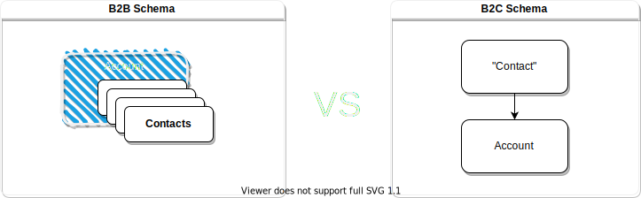

# Customer Wrapper

## B2B vs B2C Schema

Ellos nos envian contactos con una empresa, nosotros tenemos empresas con contactos.

* On the B2C schema, one customer (contact) has only one company (account) and they are related.
* On the B2B schema, the main entity is the company (account) and is able to have several contacts.
    * A company doesn't have first/last name or birthdate.

{ loading=lazy }

The data

## Uid fields to Int
`partyUid`, `GridUid`, `customer_id`

Hasta ahora teniamos campos con un formato de Uid, sin embargo, según el Swagger, estos campos tienen un formato de int (por ejemplo, el partyUid aparece que puede ser 1039287462), ha cambiado algo que tenemos que tener en cuenta? ya no sirven los valores que usabamos hasta ahora?

## Fields with logic
`to_be_deleted`, `all_tp_deleted`

Hay algún campo que tenga alguna lógica que tengamos que tener en cuenta, por ejemplo, los campos to_be_deleted y all_tp_deleted son booleanos de una lógica que se aplica en C-CCR, sin embargo, en Dynamics no tenemos estos campos.
